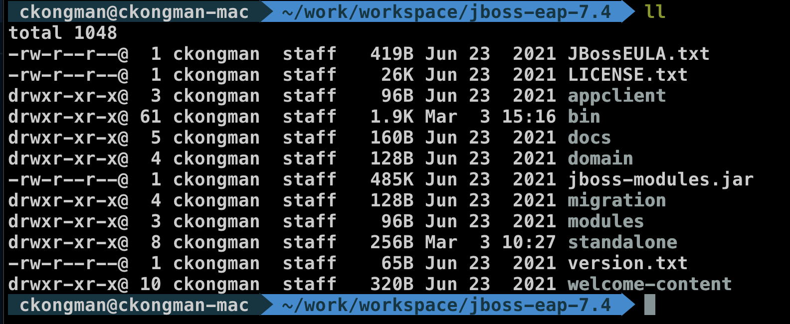
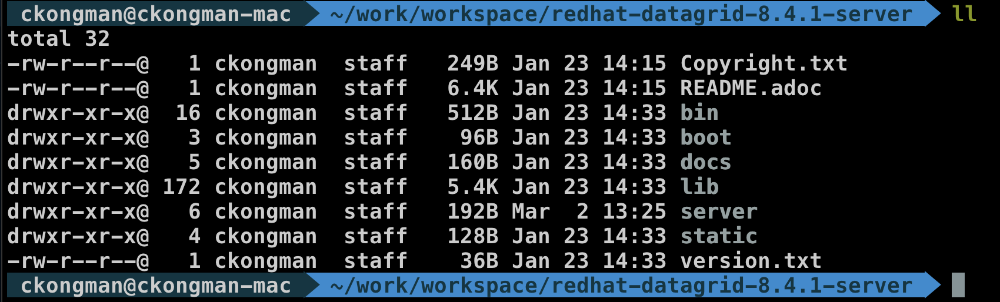
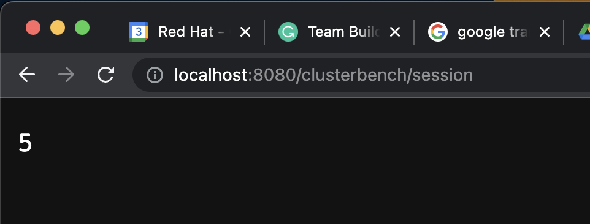
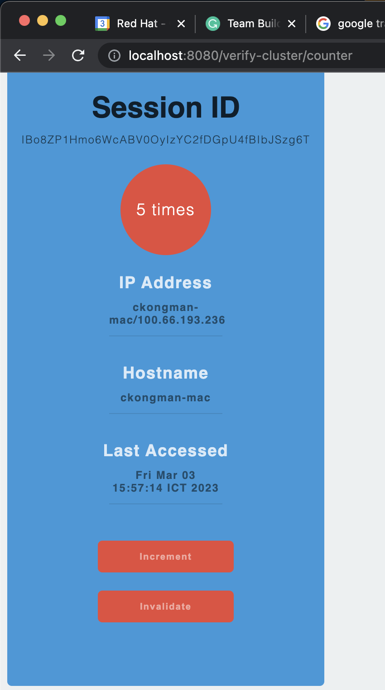

# Storing HTTP Session Data from Red Hat JBoss EAP to Red Hat Data Grid

## Prepare EAP and Data Grid
- Prerequisite --> OpenJDK 11
- JBoss EAP 7.4 --> https://access.redhat.com/jbossnetwork/restricted/listSoftware.html?downloadType=distributions&product=appplatform&version=7.4
- extract zip file to your path
  
  

- Red Hat Data Grid 8.4 --> https://access.redhat.com/jbossnetwork/restricted/listSoftware.html?downloadType=distributions&product=data.grid&version=8.4.1
- extract zip file to your path

  

## Setup & Run Red Hat Data Grid
- create data grid user (user: jbosseap, password: jbosseap, group: admin)
  
  ```bash
  cd redhat-datagrid-8.4.1-server/bin
  ./cli.sh user create jbosseap -p jbosseap -g admin
  ```

- start Red Hat Data Grid, change bind address to your ip address
  
  ```bash
  cd redhat-datagrid-8.4.1-server/bin
  ./server.sh -c infinispan.xml --cluster-stack=tcp --node-name=jdg1 --bind-address=127.0.0.1
  ```

## Setup & Run Red Hat JBoss EAP
- backup your jboss-eap-7.4/standalone/configuration/standalone-ha.xml
- configure EAP, create command line config file
  
  ```bash
  cd jboss-eap-7.4/bin
  cat <<EOT > wf.cli
  embed-server --std-out=echo --server-config=standalone-ha.xml
  /subsystem=jgroups/channel=ee:write-attribute(name=stack,value=tcp)
  /socket-binding-group=standard-sockets/remote-destination-outbound-socket-binding=infinispan-server:add(port=11222,host=127.0.0.1)
  batch
  /subsystem=infinispan/remote-cache-container=jdg_rc:add(default-remote-cluster=infinispan-server-cluster, module=org.wildfly.clustering.web.hotrod, protocol-version=3.0, statistics-enabled=true, properties={infinispan.client.hotrod.auth_username=jbosseap, infinispan.client.hotrod.auth_password=jbosseap})
  /subsystem=infinispan/remote-cache-container=jdg_rc/remote-cluster=infinispan-server-cluster:add(socket-bindings=[infinispan-server])
  run-batch
  /subsystem=infinispan/remote-cache-container=jdg_rc/near-cache=invalidation:add(max-entries=1000)
  /subsystem=distributable-web/hotrod-session-management=sm_offload:add(remote-cache-container=jdg_rc, granularity=SESSION)
  /subsystem=distributable-web/hotrod-session-management=sm_offload/affinity=local:add()
  /subsystem=distributable-web:write-attribute(name=default-session-management,value=sm_offload)
  EOT
  ```

- run configure EAP
  
  ```bash 
  cd jboss-eap-7.4/bin
  ./jboss-cli.sh --file=wf.cli
  ```

- Start EAP
  
  ```bash
  cd jboss-eap-7.4/bin
  ./standalone.sh --server-config=standalone-ha.xml -Djboss.default.jgroups.stack=tcp -Dprogram.name=wfl1 -Djboss.node.name=wfl1
  ```

## Deploy Test Application
- clusterbench-ee8.ear
  
  ```bash
  cd eap-datagrid
  cp clusterbench-ee8.ear ../jboss-eap-7.4/standalone/deployments/
  ```

- verify-cluster.war

  ```bash
  cd eap-datagrid
  cp verify-cluster.war ../jboss-eap-7.4/standalone/deployments/
  ```

- Test with your browser
  - http://localhost:8080/clusterbench/session
    
    

  - http://localhost:8080/verify-cluster
  
    

  - try increase counter, stop your EAP and try increase again to check your session counter continue.